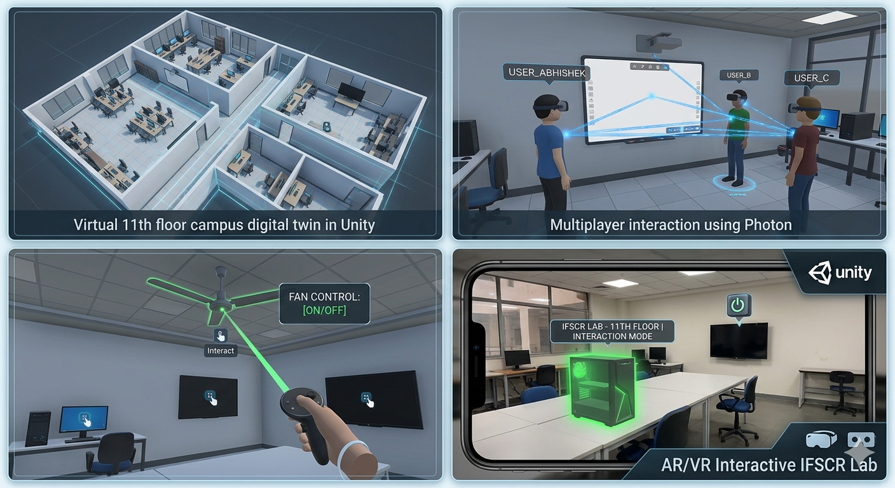

# AR/VR Interactive IFSCR Lab – Digital Twin of 11th Floor Campus

## Overview
The **AR/VR Interactive IFSCR Lab** is a digital twin project that replicates the entire 11th floor of our campus in a virtual environment. Built with **Unity**, this interactive simulation allows users to explore, interact, and collaborate in real-time. The project supports both AR and VR modes, offering an immersive experience that mirrors the physical lab environment.

## Features
- **Digital Twin of 11th Floor**: Accurate virtual replica of the campus floor, including rooms, furniture, and interactive objects.
- **Object Interactions**: Users can interact with various objects such as:
  - Turning fans on/off
  - Controlling TVs and PCs
  - Animating devices with realistic responses
- **Multiplayer Support**: Integrated with **Photon Framework** to enable multiple users to join the same virtual space, interact with objects, and see each other’s actions in real-time.
- **Single-Player Mode**: Allows individual exploration and interaction without network requirements.
- **Realistic Animations & Visuals**: High-quality models, lighting, and animations to enhance immersion.
- **Cross-Platform**: Compatible with AR and VR devices for flexible deployment.

## Technologies Used
- **Unity**: Game engine for 3D development and interaction logic.
- **Photon Unity Networking (PUN)**: For real-time multiplayer functionality.
- **C#**: Scripting for interactions, animations, and network synchronization.
- **Blender / Maya**: For 3D modeling of objects and environment.
- **XR Interaction Toolkit**: For AR/VR input and interaction handling.

## Getting Started

### Prerequisites
- Unity 2021.3 or later
- Photon Engine account (for multiplayer features)
- AR/VR device (optional, for immersive mode)

###**Future Enhancements**
- Integration with IoT for real-time data synchronization.
- Voice chat support for multiplayer collaboration.
- More interactive elements like whiteboards, lab equipment.
- WebGL build for browser-based access.

**Contributors**
Abhishek
